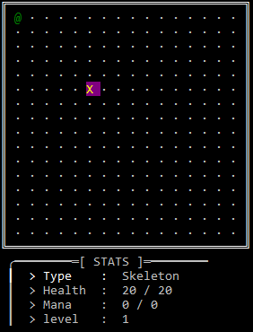

# 🌟 Welcome to Arcane Assembler! 🌟

Welcome to **Arcane Assembler**! This is a command-line interface (CLI) based game where you can explore a fantasy world as a wizard. Developed in C, this game currently features basic functionalities but is designed with the potential for more complex features in the future.

## Overview

**Arcane Assembler** is an evolving project that aims to deliver an engaging CLI-based gaming experience. Although it's currently a work in progress, the game lays the groundwork for a rich fantasy experience with turn-based RPG mechanics and a focus on magic combat. Players will encounter various monsters, unlock powerful spells, and gather items to enhance their adventure.



https://github.com/user-attachments/assets/9843834f-1b80-4b5a-97b2-3bd91aa641ab


## Features

- **Cursor**: The video and image above shows the game cursor, represented by an "X". When you press the 'e' key, the game switches to cursor mode. In this mode, instead of moving the player character, you control a cursor. The cursor can be moved around the game world, and when it hovers over an entity (such as a monster or item), detailed statistics about that entity are displayed. This feature is particularly useful for examining the attributes of entities without directly interacting with them.
  
- **Movement**: The game currently supports basic movement functionality. Players can navigate through a 2D grid-based game world. The controls are designed to be intuitive, allowing you to move up, down, left, or right within the game environment.
  
- **Behind the Scenes**:
  - **World Map**: The game features a fairly complex world map that is managed internally. This map serves as the foundation for the game’s exploration and interaction mechanics.
  - **Entity Management**: Basic management of entities, including players, enemies, and items, is implemented. This involves handling their positions, states, and interactions within the game world.

## Project Goals

- [x] **Start of Cursor Implementation**: The initial version of the cursor feature has been implemented. This allows basic functionality for moving the cursor and displaying entity statistics.
  
- [ ] **Simple Spell System**: Developing a basic spell system is a priority. This will involve creating a framework for spells, including how they are cast, their effects, and how they interact with the game world.
  
- [ ] **Inventory Management**: An inventory system will be implemented to allow players to collect, manage, and use items found throughout the game. This will enhance the gameplay experience by adding a layer of strategy and resource management.
  
- [ ] **New Enemy Types**: Additional enemy types will be introduced to diversify gameplay. Each new enemy type will have unique attributes and behaviors, providing players with new challenges and encounters.

## Installation

To get started with Arcane Assembler, you'll need a C compiler. Here’s how to set up the environment for different operating systems:

1. **Unix-Based Systems (Linux, macOS)**:
   - You likely already have `gcc` or `clang` installed. These are standard compilers for C programming on Unix-based systems.

2. **Windows**:
   - You may need to install MinGW or another compatible compiler. MinGW provides a minimal development environment for native Microsoft Windows applications.

### Steps to Install

1. **Clone the Repository**

   ```bash
   git clone https://github.com/obamamen/Arcane-Assembler-CLI-RPG-

## License

This project is licensed under the GNU Affero General Public License v3.0 (AGPL-3.0). See the [LICENSE.md](license/license.md) [LICENSE.txt](license/license.txt) file for the full license text.

The AGPL-3.0 license requires that any modified versions of this software, when used over a network, must also be distributed under the AGPL-3.0.
